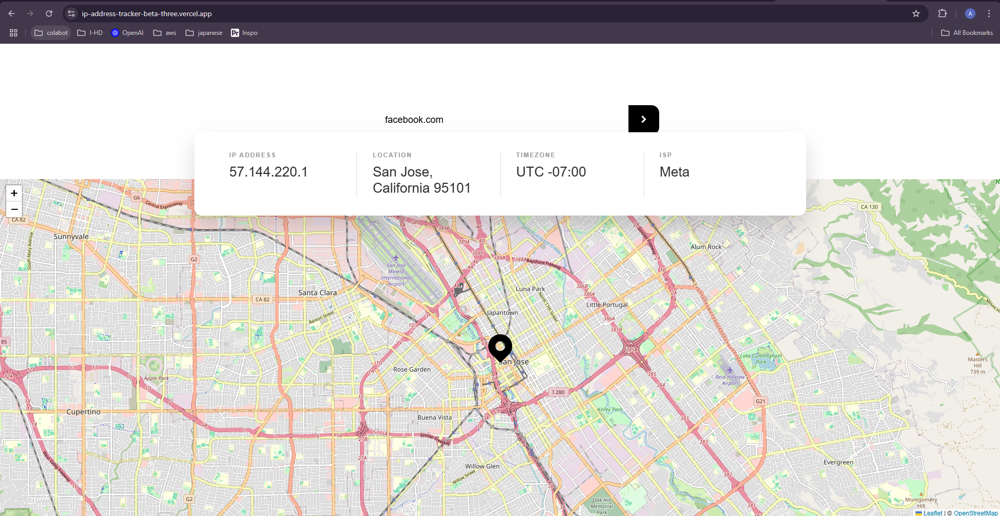
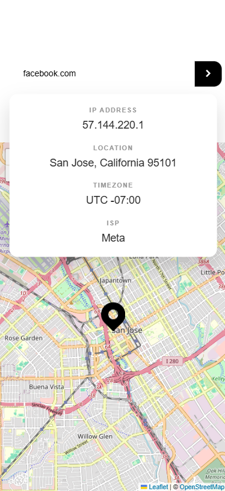

# IP Address Tracker

This is a solution to the [IP Address Tracker challenge on Frontend Mentor](https://www.frontendmentor.io/challenges/ip-address-tracker-I8-0yYAH0). The application allows users to search for any IP address or domain and see the corresponding location details displayed on an interactive map.

### [🚀 Live Demo]

---

### Desktop View


### Mobile View


## ✨ Features

-   **Live IP Geolocation:** Fetches and displays location data (IP, Location, Timezone, ISP) from an IP address or domain.
-   **Interactive Map:** Utilizes LeafletJS to display the fetched location on a fully interactive map.
-   **Initial IP Lookup:** Automatically detects and displays the user's own IP address details upon page load.
-   **Fully Responsive Design:** A mobile-first approach ensures a seamless experience on all devices, from small phones to large desktops.
-   **Secure API Key Management:** All API keys are stored securely in environment variables and are not exposed on the client-side.
-   **Clean & Maintainable Code:** API logic is separated into a dedicated service for better organization and reusability.

## 🛠️ Built With

This project was built using modern web development technologies:

-   **[Vue.js (v3)](https://vuejs.org/)**: A progressive JavaScript framework for building user interfaces.
-   **[Vite](https://vitejs.dev/)**: A next-generation, high-performance frontend tooling system.
-   **[LeafletJS](https://leafletjs.com/)**: An open-source JavaScript library for mobile-friendly interactive maps.
-   **[IPify Geolocation API](https://geo.ipify.org/)**: The API used to fetch IP address and location data.
-   **HTML5 & CSS3**: With a focus on modern, responsive layouts using Flexbox.

---

## ⚙️ Getting Started

To get a local copy up and running, follow these simple steps.

### Prerequisites

Make sure you have Node.js and npm installed on your machine.
-   Node.js (v16 or later)
-   npm

### Installation

1.  **Clone the repository:**
    ```sh
    git clone https://github.com/your-github-username/ip-tracker-app.git
    ```
2.  **Navigate into the project directory:**
    ```sh
    cd ip-tracker-app
    ```
3.  **Install the required NPM packages:**
    ```sh
    npm install
    ```
4.  **Set up your environment variables:**
    Create a new file named `.env.local` in the root of your project and add your secret IPify API key.
    ```
    VITE_IPIFY_API_KEY=YOUR_SECRET_API_KEY_HERE
    ```
5.  **Run the development server:**
    ```sh
    npm run dev
    ```
    The application should now be running locally at `http://localhost:5173` (or a similar port).

## Acknowledgments

-   This project was completed as part of the **[Frontend Mentor](https://www.frontendmentor.io)** learning platform.
-   Map tiles are provided by **[OpenStreetMap](https://www.openstreetmap.org/copyright)**.
-   Geolocation data is powered by the **[IPify API](https://www.ipify.org/)**.


Project by [Aye Nyein Chan Pyae](https://github.com/ayenyeinchanpyae)